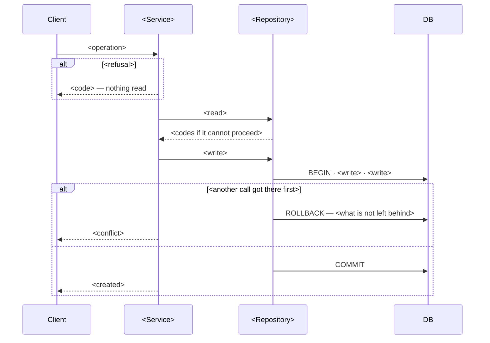

# Design document format

Load this file only when writing `.design/<name>.md` — after the verdict is confirmed, or after recording a committed decision. Do not load it during the interview.

Section headings stay as they are — readers and tools find them by name — while the prose follows the language of the document and identifiers are never translated. The document is for humans first, and for anyone who plans from it without having been in the room.

The document holds the fundamental decisions - product, API, schema, direction - and nothing the plan can derive from them. Three rules keep it that size:

1. **Each decision is stated once, at the highest level that owns it.** Key decisions is the home of everything hard to reverse; a slice refers to it, never restates it. The same fact in two sections is a defect, not a convenience.
2. **Identifier ceiling: route, table, column, class, glossary term.** Nothing below - method, token, file path, CSS selector - appears. If a plan cannot name the method from the route and the class, that is the plan's problem.
3. **The document says what will exist, not what will be done.** State tables, contracts and schemas define a slice. Lists of files to add and methods to change are the plan's output.

The design is organised **by slice**, never by kind of view. A slice is a staffable vertical: what it delivers, its status, its state table, and only the other views it has content for. A reader who wants to understand one operation reads one section.

Replace every placeholder with a concrete value, or omit the section. A heading with "N/A" under it does not appear.

## Template

Write `.design/<name>.md`.

````markdown
# <Title>

> Plan from this document. Each slice below carries its own shape - copy it, do not re-derive it.
> Status: <draft | confirmed by <who>, <date> | declined - <reason>, <who>, <date> | superseded by <path>>

## Situation

- Project: <in steady use | not shipped yet | in active construction>
- Decision: <open | committed by <who>, <when>, in <roadmap, cycle, document>>
- In flight: <what this copies as precedent; what is specified elsewhere and stays out> - one sentence each, no commit hashes, no method names
- At stake: <what being wrong costs - reverted in an afternoon | expensive | one-way>

## Problem

<Pain: who hurts, named; what it costs today, in a unit the business feels; what happens if nothing changes. Absence: who cannot do this, and what they do instead. Construction: what this piece was promised to make possible, what stalls without it, and why now rather than after the next piece. The number that moved the decision, in one line, with where it came from - or the line that says it is unmeasured and what people told you instead. No solution proposed. What exists that this has to fit is Shape's question, not Problem's.>

## Success

- Worked if: <outcome, in the problem's own unit>
- Going wrong: <what the early signal looks like when the bet is failing>
- Review: <date or trigger> - <who looks>

## Boundary

In: <what this covers>.

Out: <excluded> - <why>. <One line per item.>

Unchanged: <existing identifiers a reader might expect to change and that do not - so nobody hunts>.

## Prior art

- <the seam that repeats across independent teams> - <we take it | we do not, because>
- <the failure they report> - <which Key decision exists to stop it>
- <what they do that we do not> - <the condition of theirs we do not share>

## Shape

<Four sentences at most: what the record is, what the operation does, what is the door and what it would cost to change, the heavier alternative and its condition. No layers - the repository's rules already say them; a sentence only where this departs from them. No precedents - Situation already named them. No identifier below route, table or class.>

<The heavier alternative and the condition that would make it win, in one sentence. A paragraph only when it is live.>

## Key decisions

1. **<the hard-to-reverse decision, one bold sentence>.** <Where it lives and why - one or two sentences. No method names.>

<Five to eight. This is the only place these decisions are stated; slices refer to them by number.>

## Work

| Slice | Delivers | Status |
|---|---|---|
| [<Slice>](#<anchor>) | <what exists when it is done, one line> | clear \| open — <n> defaults taken \| rfc \| spike \| design |

Order: <slice → slice → slice>.

Already handled by existing code: <journey state → what handles it>, ...

Derivable from the repository, left to the plan: <convention>, <convention> - <"all as <existing record> does them">.

### <Slice - a domain term or a code identifier, never a prose verb>

**Delivers** <one sentence>. **Status: <clear | open | rfc | spike | design>.** <One clause if it is the door.>

| State | What should happen | Caller sees |
|---|---|---|
| <each journey state this slice answers> | <the product outcome: what is saved, refused, unchanged> | <code, and the reason string where the string is a decision> |

<Third column omitted for a slice with no caller. A slice whose states are all one kind - parent deletes - collapses to two columns.>

`<METHOD> <path>` `<request>` → `<code>` `<response>`
<One line per endpoint this slice adds. Failure codes are in the state table, not here.>

<Schema - only where this slice creates or alters a table.>

Table `<name>`; <no existing table changes | <table>: <before → after>>.

| Column | Type | Null | References | Note |
|---|---|---|---|---|
| `<column>` | <type> | yes \| no | `<table.column>` | <enum values, index, who writes it> |

<Entity diagram when the slice relates more than one record, checked against the code.>

<Flow - only where this slice holds a one-way door. Participants are layers, not files; steps are the refusal, the read, the transaction, the race - not validation details.>



<States diagram - only with three or more states, or two or more writers. Two states and one writer are a sentence in Key decisions.>

Alternatives considered: <option> - wins if <condition>. <One line, only for alternatives a reader might reasonably raise. Costly alternatives are already in Key decisions.>

<Open, default taken - numbered, only in a slice whose status is open:>
1. <question> - <default>

<RFC / spike / design - only in a slice whose status says so:>
- RFC: <question> - <what it blocks>. Not decided.
- Spike: <question only building answers> - <what each answer changes> - <when it stops>
- Design: <screen or flow> - <the states the drawing has to answer for>

### <Next slice>

...

## Migration

<Only when Situation says the product is in use. Existing rows, backfill, deploy order, what an old client sees before it updates. In construction, omit.>

## Sources

<Only the documents the research stood on. Not code paths.>

- <roadmap, decision record, earlier design document, external reference> - <what it settles>
````

## Section notes

**Status** in the header is the verdict and the only place it appears: who confirmed it and when, or that it was declined and why. The reasoning - the cheaper paths, the four outcomes weighed - stays in the conversation.

**Situation › In flight** names what this copies and what stays out, one sentence each. It is where commit hashes and method names leak in first; neither belongs.

**Problem** is for the human. It carries the number that moved the decision in one line, or the line saying it is unmeasured. It does not describe what exists that the design has to fit - that is direction, and direction is Shape's.

**Journey has no section.** Its states are asked in the interview, as product; in the document each lands in the slice that answers it, as that slice's state table. A state no slice touches is one line under Work naming what already handles it.

**Boundary › Unchanged** is where "leaves untouched" lives. Out says what is not built; Unchanged says what is not touched. Both stop a planner inventing a task.

**Shape** is four sentences at most: the thing, the operation, the door, the alternative. If it names a method, it is implementation. If it restates a Key decision, it is repetition. If it says which layers it follows, it is the repository's rules leaking in - a sentence only where the design departs from them.

**Key decisions** is the single home of everything hard to reverse: five to eight, prose, numbered. A slice that needs one of them says "Key decision 2" and moves on. A slice that restates one has doubled the document's maintenance and halved its readability.

**Work** is the index and the body: one row per slice, one section per slice, in the same order. A slice is named by a domain term or a code identifier - "Pay Invoice", never "Settle" - and the prose inside it calls the record what the glossary calls it, every time.

**A slice is its state table plus what only it can say.** The state table is the acceptance criteria. The contract is one line per endpoint. Schema appears where the slice creates a table; a flow where it holds a door; a states diagram only past two states or one writer. There is no Adds/Changes list - the plan derives files and methods from the contract, the schema and the flow - and no per-slice decisions table: what is costly is in Key decisions, what is reversible and worth a reader's objection is one "Alternatives considered" line.

**Diagrams** appear where relationship or order is the content. Participants are layers, not file paths; steps are the refusal, the read, the transaction and the race, not the trim and the existence check. Every diagram is read back against the repository before it lands.

**Invariant, not mechanism.** A Key decision says what must hold - "one Payment per Invoice, a lost race leaves no orphan" - and, where the obvious precedent would break it, says not to copy that precedent. It does not say how: the SQL predicate, the lock, the transaction shape are the plan's. Code appears almost nowhere; the literals that are product decisions - enum values, paths, response shapes - already live in the state table, the contract and the schema.

**Sources** is the bibliography of the research: the roadmap, the decision records, earlier design documents, external references. Code paths are cited inline where they settle a fact and are not listed here.
