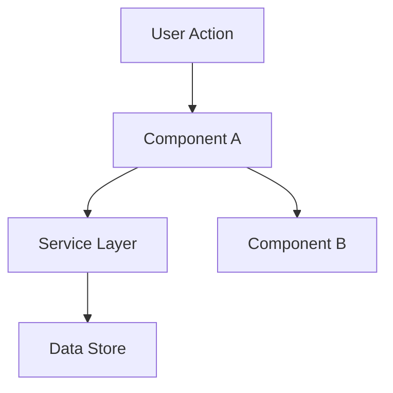

# Design

**Goal**: Define HOW to build it. Architecture, components, what to reuse.

**Skip this phase when:** The change is straightforward — no architectural decisions, no new patterns, no component interactions to plan. For simple features, design happens inline during Execute.

## Process

### 1. Load Context

Read `.specs/features/[feature]/spec.md` before designing. If `.specs/features/[feature]/context.md` exists, load it too — it contains implementation decisions that constrain the design (layout choices, behavior preferences, interaction patterns). Decisions marked as "Agent's Discretion" are yours to decide.

### 1.5. Research (Optional but Recommended)

If the feature involves unfamiliar technology, patterns, or integrations, research before designing. Document findings briefly in the design doc or as inline notes. This prevents incorrect assumptions from propagating into tasks.

Follow the **Knowledge Verification Chain** (see SKILL.md) in strict order:

```
Codebase → Project docs → Context7 MCP → Web search → Flag as uncertain
```

**CRITICAL: NEVER assume or fabricate information.** If you cannot find an answer through the chain, explicitly say "I don't know" or "I couldn't find documentation for this". Inventing an API, a pattern, or a behavior that doesn't exist is far worse than admitting uncertainty. Wrong assumptions propagate through design → tasks → implementation and cause cascading failures.

Good triggers for research: new libraries, unfamiliar APIs, performance-sensitive features, security-sensitive features, patterns you haven't used in this codebase before.

### 2. Define Architecture

Overview of how components interact. Use mermaid diagrams when helpful. Before creating any diagrams, check if the `mermaid-studio` skill is available (see Skill Integrations in SKILL.md).

### 3. Identify Code Reuse

**CRITICAL**: What existing code can we leverage? This saves tokens and reduces errors.

If `.specs/codebase/CONCERNS.md` exists, check it before designing. Any component flagged as fragile, carrying tech debt, or having test coverage gaps requires extra care in the design — document how the design mitigates those concerns.

### 4. Define Components and Interfaces

Each component: Purpose, Location, Interfaces, Dependencies, What it reuses.

### 5. Define Data Models

If the feature involves data, define models before implementation.

---

## Template: `.specs/[feature]/design.md`

````markdown
# [Feature] Design

**Spec**: `.specs/[feature]/spec.md`
**Status**: Draft | Approved

---

## Architecture Overview

[Brief description of the architecture approach]


````

---

## Code Reuse Analysis

### Existing Components to Leverage

| Component            | Location            | How to Use                |
| -------------------- | ------------------- | ------------------------- |
| [Existing Component] | `src/path/to/file`  | [Extend/Import/Reference] |
| [Existing Utility]   | `src/utils/file`    | [How it helps]            |
| [Existing Pattern]   | `src/patterns/file` | [Apply same pattern]      |

### Integration Points

| System         | Integration Method                      |
| -------------- | --------------------------------------- |
| [Existing API] | [How new feature connects]              |
| [Database]     | [How data connects to existing schemas] |

---

## Components

### [Component Name]

- **Purpose**: [What this component does - one sentence]
- **Location**: `src/path/to/component/`
- **Interfaces**:
  - `methodName(param: Type): ReturnType` - [description]
  - `methodName(param: Type): ReturnType` - [description]
- **Dependencies**: [What it needs to function]
- **Reuses**: [Existing code this builds upon]

### [Component Name]

- **Purpose**: [What this component does]
- **Location**: `src/path/to/component/`
- **Interfaces**:
  - `methodName(param: Type): ReturnType`
- **Dependencies**: [Dependencies]
- **Reuses**: [Existing code]

---

## Data Models (if applicable)

### [Model Name]

```typescript
interface ModelName {
  id: string
  field1: string
  field2: number
  createdAt: Date
}
```

**Relationships**: [How this relates to other models]

### [Model Name]

```typescript
interface AnotherModel {
  id: string
  // ...
}
```

---

## Error Handling Strategy

| Error Scenario | Handling      | User Impact      |
| -------------- | ------------- | ---------------- |
| [Scenario 1]   | [How handled] | [What user sees] |
| [Scenario 2]   | [How handled] | [What user sees] |

---

## Tech Decisions (only non-obvious ones)

| Decision          | Choice          | Rationale     |
| ----------------- | --------------- | ------------- |
| [What we decided] | [What we chose] | [Why - brief] |

---

## Tips

- **Load context first** — If context.md exists, decisions there are locked
- **Research when uncertain** — 5 minutes of research prevents hours of rework
- **Reuse is king** — Every component should reference existing patterns
- **Interfaces first** — Define contracts before implementation
- **Keep it visual** — Diagrams save 1000 words (check mermaid-studio skill in Skill Integrations)
- **Small components** — If component does 3+ things, split it
- **Check CONCERNS.md** — If it exists, flag fragile areas the design must address
- **Confirm before Tasks** — User approves design before breaking into tasks
