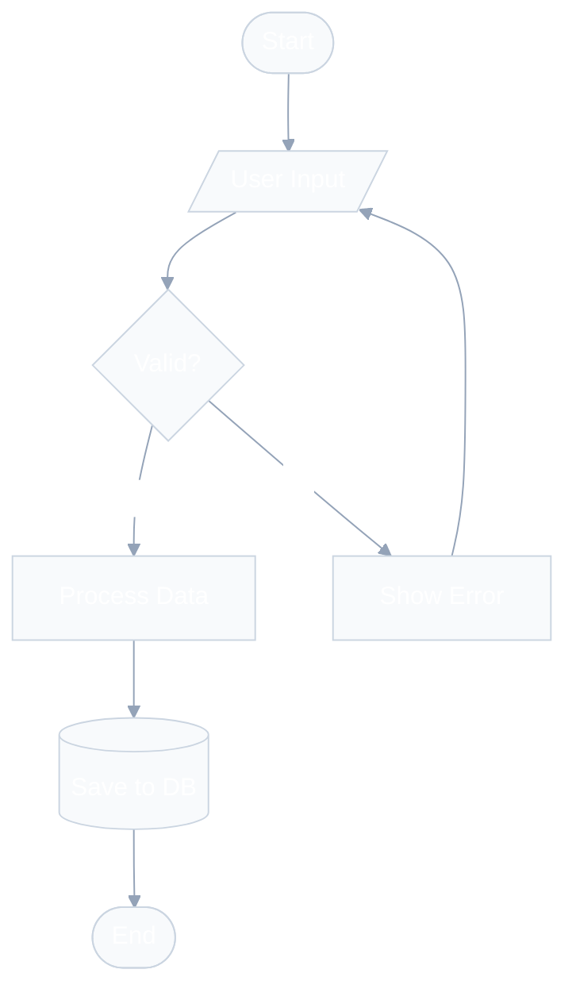
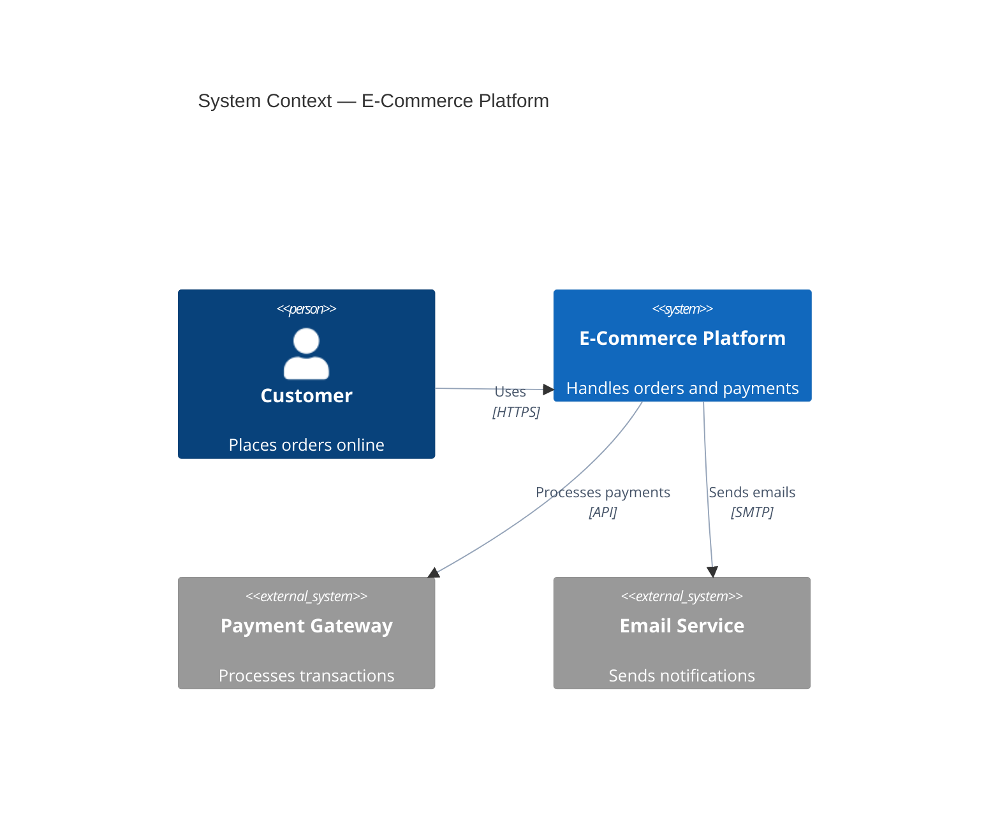

# Mermaid Studio

Expert-level Mermaid diagram creation, validation, and multi-format rendering. Creates diagrams from descriptions or code analysis, validates syntax, and renders to SVG, PNG, or ASCII with professional theming.

## Golden Rules — Elegant Diagrams by Default

Every diagram MUST follow these principles. They are not optional — they define the difference between a mediocre diagram and a gold-standard one.

### Rule 1: Always Use an Init Directive for Professional Styling

**NEVER** create a diagram without an `%%{init}` directive or frontmatter config. The default Mermaid theme produces harsh black lines and generic colors. Always apply a curated palette.

**For general diagrams (flowchart, sequence, state, class, ERD):**

```
%%{init: {'theme': 'base', 'themeVariables': {
  'primaryColor': '#4f46e5', 'primaryTextColor': '#ffffff',
  'primaryBorderColor': '#3730a3', 'lineColor': '#94a3b8',
  'secondaryColor': '#10b981', 'tertiaryColor': '#f59e0b',
  'background': '#ffffff', 'mainBkg': '#f8fafc',
  'nodeBorder': '#cbd5e1', 'clusterBkg': '#f1f5f9',
  'clusterBorder': '#e2e8f0', 'titleColor': '#1e293b',
  'edgeLabelBackground': '#ffffff', 'textColor': '#334155'
}}}%%
```

**⚠️ Font Warning:** Do NOT set `fontFamily` in theme variables. The Mermaid default font (`trebuchet ms, verdana, arial, sans-serif`) works everywhere. Setting `system-ui`, `Segoe UI`, or `-apple-system` will render as Times New Roman in headless Chromium (used by `mmdc`).

**For C4 diagrams — see the dedicated C4 styling section below.**

**For architecture-beta diagrams — see the dedicated AWS/Architecture section below.**

### Rule 2: Soft Lines, Never Harsh Black

The single biggest visual improvement is using `lineColor: '#94a3b8'` (slate-400) instead of the default black. This creates a modern, breathable diagram. For dark themes, use `lineColor: '#64748b'` (slate-500).

### Rule 3: Limit Density — Breathe

- Maximum 15 nodes per diagram (not 20 — fewer is more elegant)
- Use `subgraph` or boundaries to create whitespace and visual grouping
- Prefer LR (left-right) for process flows — it reads more naturally
- Use invisible links (`A ~~~ B`) to add spacing when the layout is cramped

### Rule 4: Meaningful Labels and Consistent Style

- Node IDs: camelCase (`orderService`, not `s1` or `os`)
- Labels: short, clear natural language (`[Order Service]`)
- Arrows: action verbs with protocol info (`"Sends order via gRPC"`)
- Descriptions: one-line, role-focused (`"Handles order lifecycle"`)

### Rule 5: Color Harmony Over Color Variety

Use max 3-4 colors per diagram. Map colors to meaning:

- **Blue tones** (#4f46e5, #3b82f6) → primary systems, internal services
- **Green tones** (#10b981, #059669) → success states, data stores
- **Amber tones** (#f59e0b, #d97706) → external systems, warnings
- **Slate tones** (#64748b, #94a3b8) → lines, borders, secondary elements
- **Red tones** (#ef4444) → errors ONLY, never as decoration

## Modes of Operation

This skill operates in three modes based on user intent:

| Mode       | Trigger                                           | What happens               |
| ---------- | ------------------------------------------------- | -------------------------- |
| **Create** | "draw a diagram of...", "visualize my..."         | Generates .mmd code only   |
| **Render** | "render this mermaid", "convert to SVG/PNG/ASCII" | Renders existing .mmd      |
| **Full**   | "create and render...", ambiguous requests        | Create → Validate → Render |

Default to **Full** mode when intent is unclear.

## Step 1: Understand the Request

Before writing any Mermaid code, determine:

1. **What to diagram** — system, flow, schema, architecture, code structure?
2. **Which diagram type** — use the Decision Matrix below
3. **Output format** — code only, SVG, PNG, or ASCII?
4. **Theme preference** — ask only if rendering; default to `base` theme with curated palette

### Diagram Type Decision Matrix

| User describes...                              | Diagram Type  | Syntax keyword       |
| ---------------------------------------------- | ------------- | -------------------- |
| Process, algorithm, decision tree, workflow    | Flowchart     | `flowchart TD/LR`    |
| API calls, message passing, request/response   | Sequence      | `sequenceDiagram`    |
| Database schema, table relationships           | ERD           | `erDiagram`          |
| OOP classes, domain model, interfaces          | Class         | `classDiagram`       |
| State machine, lifecycle, transitions          | State         | `stateDiagram-v2`    |
| High-level system overview (C4 Level 1)        | C4 Context    | `C4Context`          |
| Applications, databases, services (C4 Level 2) | C4 Container  | `C4Container`        |
| Internal components (C4 Level 3)               | C4 Component  | `C4Component`        |
| Request flows with numbered steps              | C4 Dynamic    | `C4Dynamic`          |
| Infrastructure, cloud deployment               | C4 Deployment | `C4Deployment`       |
| Cloud services with icons (AWS/GCP/Azure)      | Architecture  | `architecture-beta`  |
| Project timeline, scheduling                   | Gantt         | `gantt`              |
| Proportional data, percentages                 | Pie           | `pie`                |
| Brainstorming, hierarchical ideas              | Mindmap       | `mindmap`            |
| Historical events, chronology                  | Timeline      | `timeline`           |
| Branching strategy, git history                | Git Graph     | `gitGraph`           |
| Flow quantities, resource distribution         | Sankey        | `sankey-beta`        |
| X/Y data visualization                         | XY Chart      | `xychart-beta`       |
| Priority matrix, strategic positioning         | Quadrant      | `quadrantChart`      |
| Layout control, grid positioning               | Block         | `block-beta`         |
| Network packets, protocol headers              | Packet        | `packet-beta`        |
| Task boards, kanban workflow                   | Kanban        | `kanban`             |
| User experience, satisfaction scoring          | User Journey  | `journey`            |
| System requirements traceability               | Requirement   | `requirementDiagram` |

If the user's description doesn't clearly map to one type, suggest 2-3 options with a brief rationale for each, then let them choose.

### When to Load References

Load reference files ONLY when needed for the specific diagram type:

- **C4 diagrams** → Read `references/c4-architecture.md` BEFORE writing code
- **AWS/Cloud architecture** → Read `references/aws-architecture.md` BEFORE writing code
- **Code-to-diagram** → Read `references/code-to-diagram.md` BEFORE analyzing
- **Theming/styling** → Read `references/themes.md` when user requests custom themes
- **Syntax errors** → Read `references/troubleshooting.md` when validation fails
- **Any diagram type details** → Read `references/diagram-types.md` for comprehensive syntax

## Step 2: Create the Diagram

### 2.1 — Write Mermaid Code

Follow these principles in order of priority:

1. **Elegance first** — every diagram must look professional with init directives and curated colors
2. **Correctness** — valid syntax that renders without errors
3. **Clarity** — meaningful labels, logical flow direction, clear relationships
4. **Simplicity** — under 15 nodes per diagram; split complex systems into multiple
5. **Consistency** — uniform naming (camelCase for IDs, descriptive labels in brackets)

### 2.2 — Structure Rules

```
%% Diagram: [Purpose] | Author: [auto] | Date: [auto]
%%{init: {'theme': 'base', 'themeVariables': { ... }}}%%
[diagramType]
    [content]
```

**CRITICAL:** The `%%{init}` directive MUST go on the very first non-comment line, BEFORE the diagram type declaration. Alternatively, use YAML frontmatter at the absolute start of the file.

**Naming conventions:**

- Node IDs: camelCase, descriptive (`orderService`, not `s1`)
- Labels: natural language in brackets (`[Order Service]`)
- Relationships: action verbs (`"Sends order to"`, `"Reads from"`)

**Layout best practices:**

- `TD` (top-down) for hierarchical flows and processes
- `LR` (left-right) for timelines, pipelines, and sequential processes
- `RL` for right-to-left reading contexts
- Use `subgraph` to group related nodes; name subgraphs meaningfully
- Add `direction` inside subgraphs when needed for different flow

### 2.3 — Quick Reference Examples

**Flowchart (with professional styling):**



For sequence diagram and ERD styling examples, read `references/themes.md`.

**C4 Context (with MANDATORY elegant styling):**



**Architecture (AWS with Iconify icons):**

```mermaid
architecture-beta
    group vpc(logos:aws-vpc)[VPC]

    service api(logos:aws-api-gateway)[API Gateway] in vpc
    service lambda(logos:aws-lambda)[Lambda] in vpc
    service db(logos:aws-dynamodb)[DynamoDB] in vpc
    service s3(logos:aws-s3)[S3 Bucket]

    api:R --> L:lambda
    lambda:R --> L:db
    lambda:B --> T:s3
```



**IMPORTANT:** Architecture-beta diagrams with `logos:*` icons require icon pack registration. When rendering with the render script, use the `--icons logos` flag. If rendering in a markdown viewer that doesn't support icon packs, use the built-in icons (`cloud`, `database`, `disk`, `server`, `internet`) as fallback. Read `references/aws-architecture.md` for the complete icon catalog and rendering instructions.

For comprehensive syntax of ALL diagram types, read `references/diagram-types.md`.

## C4 Diagrams — Mandatory Styling Guide

C4 diagrams have **fixed element styling** (blue boxes for systems, gray for persons, etc.), but their **relationship lines default to harsh black** which creates visual noise. You MUST apply these styling rules:

### The C4 Styling Pattern

Every C4 diagram MUST include these directives at the end:

```
    %% === MANDATORY STYLING ===
    %% Apply soft line colors to ALL relationships
    UpdateRelStyle(fromAlias, toAlias, $textColor="#475569", $lineColor="#94a3b8")
    %% Repeat for each Rel() in the diagram

    %% Optimize layout spacing
    UpdateLayoutConfig($c4ShapeInRow="3", $c4BoundaryInRow="1")
```

### C4 Color Values Reference

| Purpose           | Color     | Hex       | Notes                                    |
| ----------------- | --------- | --------- | ---------------------------------------- |
| Soft line color   | Slate-400 | `#94a3b8` | Replaces harsh default black             |
| Line text color   | Slate-600 | `#475569` | Readable but not dominant                |
| Accent line       | Blue-400  | `#60a5fa` | For highlighted or primary relationships |
| Warning line      | Amber-500 | `#f59e0b` | For external/risky connections           |
| Custom element bg | Emerald   | `#10b981` | For data stores or success highlights    |
| Custom element bg | Indigo    | `#4f46e5` | For primary system emphasis              |

### C4 Layout Tips

**CRITICAL — Maximum 6 `Rel()` per diagram.** More than 6 relationships causes Dagre to route arrows through nodes, creating unreadable spaghetti. If your system needs more connections, split it into multiple focused diagrams.

- Use `$c4ShapeInRow="3"` for most diagrams (prevents horizontal crowding)
- Use `$c4ShapeInRow="2"` for diagrams with long labels
- Use `$c4BoundaryInRow="1"` always (stacks boundaries vertically for clarity)
- Apply `$offsetY="-10"` to `UpdateRelStyle` when labels overlap with elements
- Prefer tree-shaped topologies (1 in, 1-2 out per node) over mesh topologies
- Declare elements in flow order — the order of `Container()` declarations affects layout
- Use directional `Rel_D`, `Rel_R`, etc. only as a last resort when auto-layout creates overlapping

For comprehensive C4 syntax, examples, and patterns, read `references/c4-architecture.md`.

## Step 3: Validate

Before rendering, ALWAYS validate the Mermaid syntax:

```bash
node $SKILL_DIR/scripts/validate.mjs <file.mmd>
```

If validation fails:

1. Read the error message carefully
2. Consult `references/troubleshooting.md` for common fixes
3. Fix the syntax and re-validate
4. Maximum 3 fix attempts before asking the user for clarification

## Step 4: Render

### 4.1 — Setup (First Run Only)

```bash
bash $SKILL_DIR/scripts/setup.sh
```

This auto-installs both rendering engines and icon pack dependencies. Run once per environment.

### 4.2 — Single Diagram Rendering

```bash
# SVG (default — best quality)
node $SKILL_DIR/scripts/render.mjs -i diagram.mmd -o diagram.svg

# PNG (for documents/presentations)
node $SKILL_DIR/scripts/render.mjs -i diagram.mmd -o diagram.png --width 1200

# ASCII (for terminals/READMEs)
node $SKILL_DIR/scripts/render-ascii.mjs -i diagram.mmd

# With icon packs (architecture-beta with AWS/tech icons)
node $SKILL_DIR/scripts/render.mjs -i diagram.mmd -o diagram.svg --icons logos,fa
```

The `--icons` flag registers Iconify packs before rendering. Packs: `logos` (AWS/tech), `fa` (Font Awesome). Use `logos` for AWS.

### 4.3 — Batch Rendering

For multiple diagrams at once:

```bash
node $SKILL_DIR/scripts/batch.mjs \
  --input-dir ./diagrams \
  --output-dir ./rendered \
  --format svg \
  --theme default \
  --workers 4
```

### 4.4 — Available Themes

**beautiful-mermaid (15):** `tokyo-night` | `tokyo-night-storm` | `tokyo-night-light` | `dracula` | `nord` | `nord-light` | `catppuccin-mocha` | `catppuccin-latte` | `github-dark` | `github-light` | `solarized-dark` | `solarized-light` | `one-dark` | `zinc-dark` | `zinc-light`

**mermaid-cli native (5):** `default` | `forest` | `dark` | `neutral` | `base`

Custom theme: `--theme base --config '{"theme":"base","themeVariables":{"primaryColor":"#4f46e5","lineColor":"#94a3b8"}}'`

For the full theme catalog, read `references/themes.md`. The render script auto-selects the best engine (mmdc primary, beautiful-mermaid fallback, Puppeteer for icon packs).

## Step 5: Code-to-Diagram (When Requested)

When the user asks to visualize existing code or architecture:

1. Read `references/code-to-diagram.md` for the analysis methodology
2. Analyze the codebase to identify the right diagram type:
   - Module dependencies → Flowchart or Class diagram
   - API routes and handlers → Sequence diagram
   - Database models/schemas → ERD
   - Service architecture → C4 Container or Architecture diagram
   - State machines in code → State diagram
3. Generate the .mmd file **with proper init directives** (Golden Rule 1)
4. Validate and render as usual

## Troubleshooting Quick Reference

| Symptom               | Likely Cause       | Fix                                                    |
| --------------------- | ------------------ | ------------------------------------------------------ |
| Diagram won't render  | Syntax error       | Run validate.mjs, check brackets/quotes                |
| Labels cut off        | Text too long      | Shorten labels or use line breaks `<br/>`              |
| Layout looks wrong    | Wrong direction    | Try different TD/LR/BT/RL                              |
| Nodes overlap         | Too many nodes     | Split into subgraphs or multiple diagrams              |
| Lines too dark/thick  | No init directive  | Add `%%{init}` with `lineColor: '#94a3b8'`             |
| C4 lines overlapping  | No styling applied | Add `UpdateRelStyle` with offsets to each Rel          |
| AWS icons not showing | No icon pack       | Use `--icons logos` flag or fallback to built-in icons |
| `mmdc` not found      | Not installed      | Run `setup.sh`                                         |
| Theme not applied     | Wrong engine       | beautiful-mermaid themes only work with that engine    |

For comprehensive troubleshooting, read `references/troubleshooting.md`.

## Output Conventions

- Save .mmd source files alongside rendered outputs
- Naming: `{purpose}-{type}.mmd` (e.g., `auth-flow-sequence.mmd`)
- For batch: maintain input filename, change extension
- Always provide both the .mmd source and rendered file to the user
