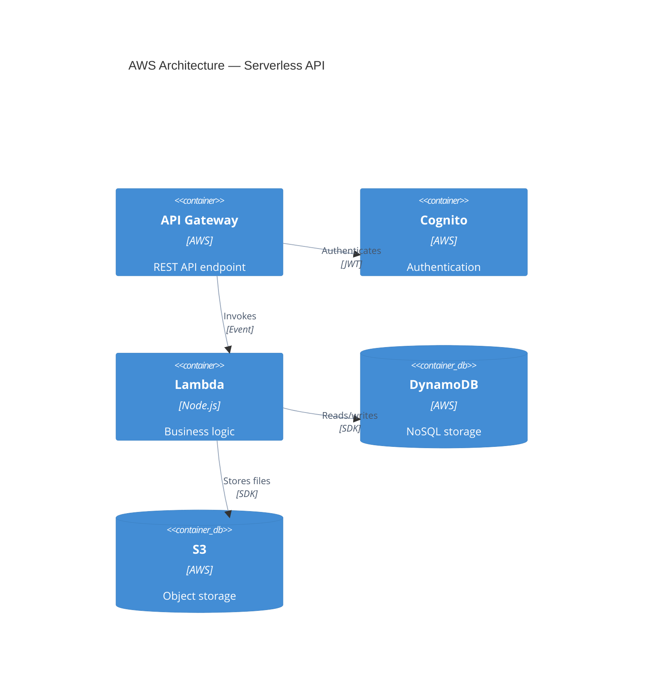
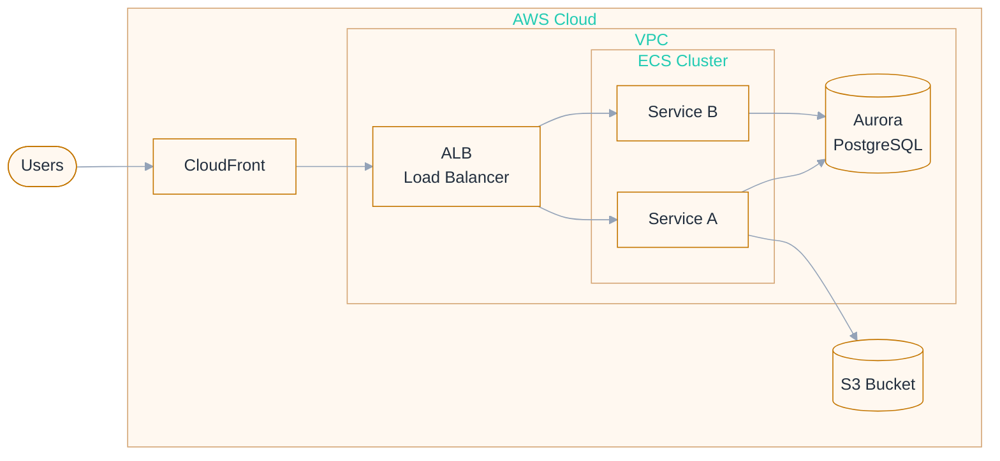

# AWS Architecture Diagrams — Complete Reference

Load this file when the user requests cloud architecture diagrams, AWS infrastructure visualization, or `architecture-beta` diagrams.

## Overview

Mermaid's `architecture-beta` diagram type enables cloud architecture visualization with icons representing services. Combined with Iconify icon packs, it produces professional infrastructure diagrams with real AWS service icons.

**CRITICAL LIMITATION — The "Arrow Distance" Bug:**
Because `architecture-beta` is built on a rigid grid system without edge routing algorithms, diagrams with more than 6-8 nodes or complex crossing relationships will suffer from **massive, unreadable distances** between nodes and arrows crossing over boxes.

**The Golden Rule for AWS Diagrams:**

- **Simple (< 8 nodes, linear flow):** Use `architecture-beta` with `--icons logos`.
- **Complex (> 8 nodes, microservices, multiple tiers):** You MUST use **Option A: C4 Container Diagram**. C4 uses the `dagre` layout engine which perfectly spaces nodes and routes arrows beautifully.

**Important — Icon Rendering:**

- `architecture-beta` requires Mermaid v11+
- Icons from Iconify packs (`logos:aws-*`) require icon pack registration at render time — they do NOT work in static markdown renderers (GitHub, GitLab)
- When rendering with the render script, use `--icons logos` to auto-register icon packs
- For environments without icon pack support, the built-in icons (`cloud`, `database`, `disk`, `server`, `internet`) work everywhere as a fallback
- For universal compatibility, consider using C4 diagrams with descriptive labels as an alternative

## Basic Syntax

```mermaid
architecture-beta

    group groupId(icon)[Label]

    service serviceId(icon)[Label] in groupId

    serviceA:R --> L:serviceB
```

### Building Blocks

| Element          | Syntax                               | Purpose                                |
| ---------------- | ------------------------------------ | -------------------------------------- |
| Group            | `group id(icon)[Label]`              | Visual boundary (VPC, region, account) |
| Service          | `service id(icon)[Label]`            | Individual service node                |
| Service in group | `service id(icon)[Label] in groupId` | Service inside a group                 |
| Edge             | `serviceA:Side --> Side:serviceB`    | Connection with direction              |

### Edge Sides

Edges connect from/to specific sides of services:

- `L` — Left
- `R` — Right
- `T` — Top
- `B` — Bottom

```
api:R --> L:lambda        %% api's right connects to lambda's left
lambda:B --> T:db          %% lambda's bottom connects to db's top
```

### Edge Types

```
serviceA:R --> L:serviceB     %% Solid arrow (default)
serviceA:R -- L:serviceB      %% Solid line (no arrow)
```

## Icon Options

### Option 1: Iconify Icons (Best Visual Quality)

Mermaid supports 200,000+ icons from iconify.design via `registerIconPacks()`. The `logos` pack provides the best AWS icons. To render with these icons, use `--icons logos` with the render script.

**Format:** `logos:aws-{service-name}`

### Option 2: Built-in Icons (Universal Compatibility)

Available everywhere without any registration. Use these when targeting markdown renderers or when icon packs aren't available:
`cloud`, `database`, `disk`, `internet`, `server`

## AWS Service Icons Catalog (Iconify `logos` Pack)

### Compute

| Service    | Icon name (logos)             | Built-in fallback |
| ---------- | ----------------------------- | ----------------- |
| Lambda     | `logos:aws-lambda`            | `server`          |
| EC2        | `logos:aws-ec2`               | `server`          |
| ECS        | `logos:aws-ecs`               | `server`          |
| Fargate    | `logos:aws-fargate`           | `server`          |
| Elastic BK | `logos:aws-elastic-beanstalk` | `server`          |

### Storage

| Service | Icon name (logos)   | Built-in fallback |
| ------- | ------------------- | ----------------- |
| S3      | `logos:aws-s3`      | `disk`            |
| EBS     | `logos:aws-ebs`     | `disk`            |
| EFS     | `logos:aws-efs`     | `disk`            |
| Glacier | `logos:aws-glacier` | `disk`            |

### Database

| Service     | Icon name (logos)       | Built-in fallback |
| ----------- | ----------------------- | ----------------- |
| RDS         | `logos:aws-rds`         | `database`        |
| DynamoDB    | `logos:aws-dynamodb`    | `database`        |
| ElastiCache | `logos:aws-elasticache` | `database`        |
| Aurora      | `logos:aws-aurora`      | `database`        |
| Redshift    | `logos:aws-redshift`    | `database`        |
| DocumentDB  | `logos:aws-documentdb`  | `database`        |

### Networking

| Service     | Icon name (logos)                  | Built-in fallback |
| ----------- | ---------------------------------- | ----------------- |
| API Gateway | `logos:aws-api-gateway`            | `server`          |
| CloudFront  | `logos:aws-cloudfront`             | `internet`        |
| Route 53    | `logos:aws-route53`                | `internet`        |
| ELB/ALB     | `logos:aws-elastic-load-balancing` | `server`          |
| VPC         | `logos:aws-vpc`                    | `cloud`           |

### Messaging

| Service     | Icon name (logos)       | Built-in fallback |
| ----------- | ----------------------- | ----------------- |
| SQS         | `logos:aws-sqs`         | `server`          |
| SNS         | `logos:aws-sns`         | `server`          |
| EventBridge | `logos:aws-eventbridge` | `server`          |
| Kinesis     | `logos:aws-kinesis`     | `server`          |

### Integration & Orchestration

| Service        | Icon name (logos)          | Built-in fallback |
| -------------- | -------------------------- | ----------------- |
| Step Functions | `logos:aws-step-functions` | `server`          |
| AppSync        | `logos:aws-app-sync`       | `server`          |

### Monitoring & Security

| Service    | Icon name (logos)      | Built-in fallback |
| ---------- | ---------------------- | ----------------- |
| CloudWatch | `logos:aws-cloudwatch` | `server`          |
| IAM        | `logos:aws-iam`        | `server`          |
| Cognito    | `logos:aws-cognito`    | `server`          |
| WAF        | `logos:aws-waf`        | `server`          |

### DevOps & CI/CD

| Service      | Icon name (logos)        | Built-in fallback |
| ------------ | ------------------------ | ----------------- |
| CodePipeline | `logos:aws-codepipeline` | `server`          |
| CodeBuild    | `logos:aws-codebuild`    | `server`          |
| CodeDeploy   | `logos:aws-codedeploy`   | `server`          |
| ECR          | `logos:aws-ecr`          | `server`          |

### ML/AI

| Service   | Icon name (logos)     | Built-in fallback |
| --------- | --------------------- | ----------------- |
| SageMaker | `logos:aws-sagemaker` | `server`          |

**Note:** Not all AWS services have icons in the `logos` pack. If a specific icon is not available, use the closest category-appropriate built-in icon as fallback. You can verify icon availability at https://icon-sets.iconify.design/?q=aws.

## Architecture Patterns

### Pattern 1: Three-Tier Web Application

**With Iconify Icons (best quality — requires `--icons logos`):**

```mermaid
architecture-beta
    group vpc(logos:aws-vpc)[VPC]
    group publicSubnet(cloud)[Public Subnet] in vpc
    group privateSubnet(cloud)[Private Subnet] in vpc
    group dataSubnet(database)[Data Subnet] in vpc

    service cdn(logos:aws-cloudfront)[CloudFront]
    service alb(logos:aws-elastic-load-balancing)[ALB] in publicSubnet
    service ecs(logos:aws-ecs)[ECS Fargate] in privateSubnet
    service rds(logos:aws-aurora)[Aurora PostgreSQL] in dataSubnet
    service cache(logos:aws-elasticache)[ElastiCache Redis] in dataSubnet

    cdn:R --> L:alb
    alb:R --> L:ecs
    ecs:R --> L:rds
    ecs:B --> T:cache
```



**With Built-in Icons (universal compatibility):**


### Pattern 2: Serverless API

```mermaid
architecture-beta
    group api(cloud)[API Layer]
    group storage(cloud)[Storage]

    service gw(logos:aws-api-gateway)[API Gateway] in api
    service auth(logos:aws-cognito)[Cognito] in api
    service fn(logos:aws-lambda)[Lambda] in api
    service dynamo(logos:aws-dynamodb)[DynamoDB] in storage
    service s3(logos:aws-s3)[S3] in storage

    gw:R --> L:fn
    gw:B --> T:auth
    fn:R --> L:dynamo
    fn:B --> T:s3
```



### Pattern 3: Data Pipeline

```mermaid
architecture-beta
    group sources(cloud)[Data Sources]
    group pipeline(cloud)[Pipeline]
    group analytics(cloud)[Analytics]

    service s3raw(logos:aws-s3)[S3 Raw Data] in sources
    service kinesis(logos:aws-kinesis)[Kinesis Stream] in sources
    service glue(logos:aws-glue)[Glue ETL] in pipeline
    service stepFn(logos:aws-step-functions)[Step Functions] in pipeline
    service s3processed(logos:aws-s3)[S3 Processed] in pipeline
    service athena(logos:aws-athena)[Athena] in analytics
    service quicksight(logos:aws-quicksight)[QuickSight] in analytics

    s3raw:R --> L:glue
    kinesis:R --> L:glue
    glue:R --> L:stepFn
    stepFn:R --> L:s3processed
    s3processed:R --> L:athena
    athena:R --> L:quicksight
```



### Pattern 4: CI/CD Pipeline


## Rendering with Icon Packs

### Using the Render Script

To render architecture-beta diagrams with proper AWS icons:

```bash
node $SKILL_DIR/scripts/render.mjs \
  --input diagram.mmd \
  --output diagram.svg \
  --format svg \
  --icons logos
```

The `--icons logos` flag tells the render script to register the Iconify `logos` pack which includes all `logos:aws-*` icons. The render script uses a Puppeteer-based pipeline for icon-enabled rendering.

### Multiple Icon Packs

You can register multiple packs:

```bash
node $SKILL_DIR/scripts/render.mjs \
  --input diagram.mmd \
  --output diagram.svg \
  --icons logos,fa
```

Available packs: `logos` (AWS + tech logos), `fa` (Font Awesome icons).

### How Icon Registration Works

The render script generates an HTML page with Mermaid loaded, registers icon packs via `mermaid.registerIconPacks()`, renders the diagram, and captures the SVG output. This is equivalent to:

```javascript
import mermaid from 'mermaid'

mermaid.registerIconPacks([
  {
    name: 'logos',
    loader: () => fetch('https://unpkg.com/@iconify-json/logos/icons.json').then((res) => res.json()),
  },
])
```

## Fallback Strategy

When `architecture-beta` is not supported by the rendering environment OR icons don't render, use these alternatives:

### Option A: C4 Container Diagram (Best Alternative)

C4 diagrams work everywhere and convey the same information:



### Option B: Flowchart with AWS Labels and Professional Styling



## Best Practices

1. **Group by boundary** — VPC, subnet, region, account
2. **Left-to-right flow** — request path should read naturally
3. **Limit to 12 services max** — split complex architectures into multiple focused diagrams
4. **Show only one concern per diagram** — networking, compute, data, separately
5. **Include external systems** — show what connects from outside
6. **Security boundaries** — show public vs private subnets
7. **Use Iconify icons when rendering** — `logos:aws-*` for best visual quality
8. **Use built-in icons for docs** — `cloud`, `database`, `disk`, `server`, `internet` for markdown compatibility
9. **Always provide both versions** — one with Iconify icons for rendered output, one with built-in for inline markdown
